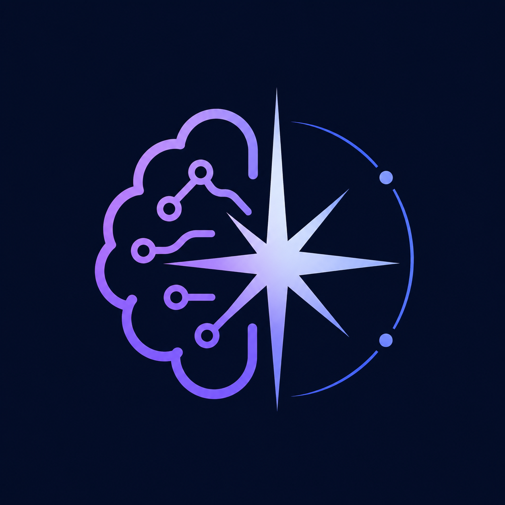
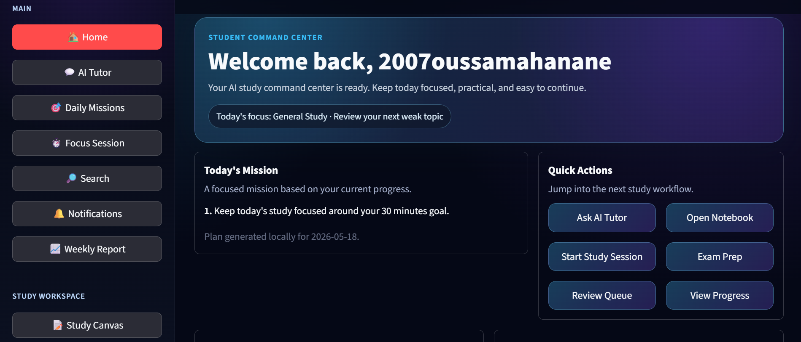
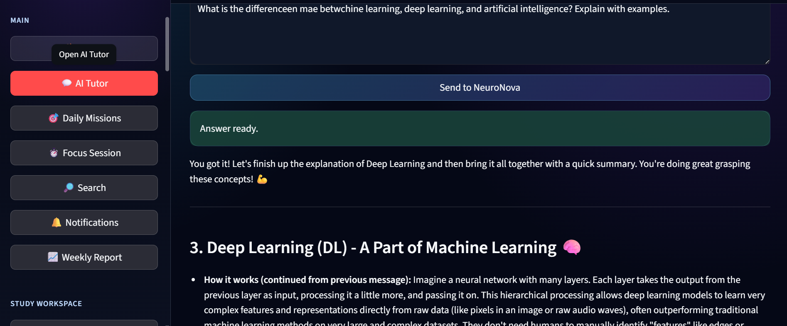
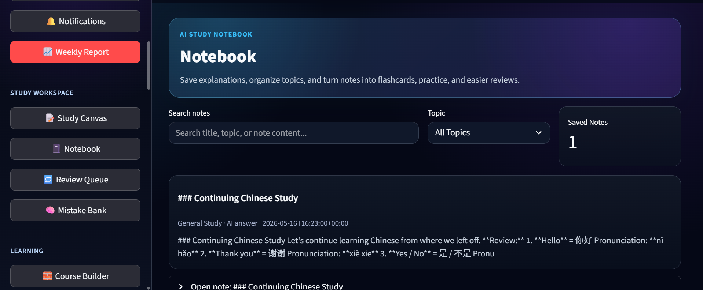
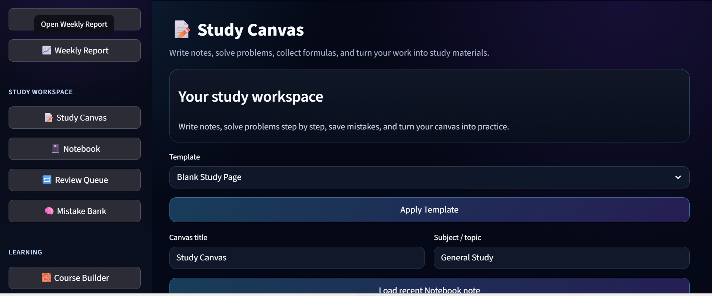
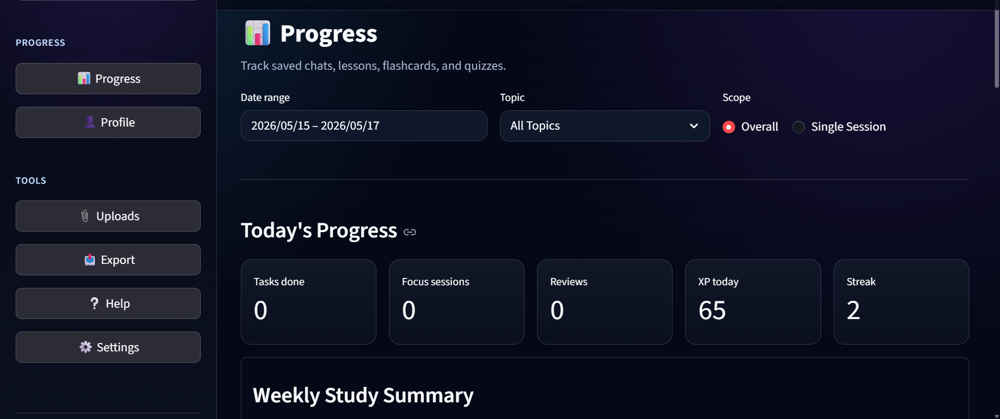
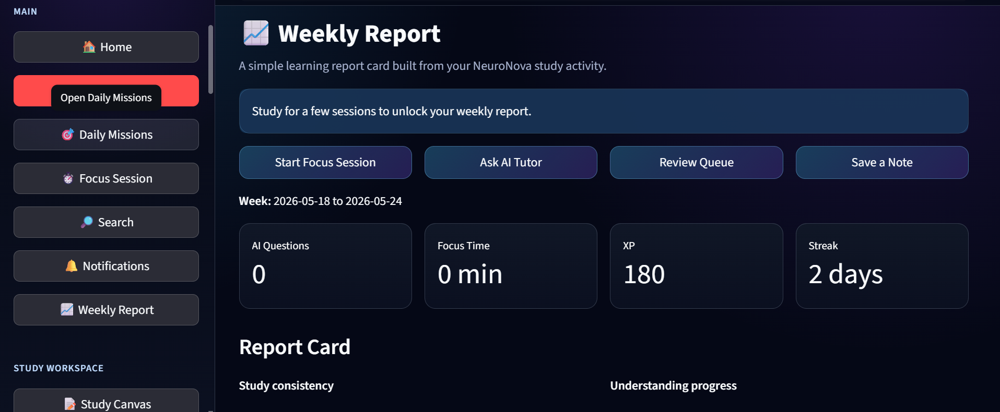
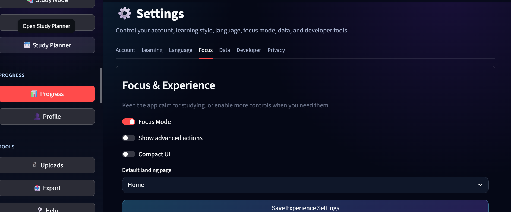

# NeuroNova



**AI Study Assistant & Learning Platform**

Live demo: https://neuronova-9e12.onrender.com

> This is a public showcase repository. The main source-code repository is private.

## About NeuroNova

NeuroNova is an AI-powered study platform designed to help students learn, save useful explanations, practice actively, review weak topics, and track progress over time. The project began as a Streamlit MVP and is being prepared as a portfolio/product showcase for public viewing.

## Why NeuroNova Is Different From A Normal Chatbot

A normal chatbot answers one question at a time. NeuroNova is built around a study workflow:

**Ask -> Save -> Practice -> Review -> Track Progress**

Instead of leaving useful answers inside a chat history, NeuroNova connects AI tutoring with notebook notes, flashcards, quizzes, review queues, study planning, weekly reports, personalization, and progress dashboards.

## Key Features

- AI Tutor for step-by-step explanations
- Notebook for saving useful study answers
- Flashcards, quizzes, and review workflows
- Study Planner and Daily Missions
- Focus Session support
- Upload-to-study workflow for PDFs, images, TXT, and Markdown
- Progress dashboard and weekly report
- Personalized learning preferences
- Safety-focused MVP deployment settings
- Developer and quality tools used during private development

## Screenshots

| Home | AI Tutor Focus Mode |
| --- | --- |
|  |  |

| Notebook | Study Canvas |
| --- | --- |
|  |  |

| Progress | Weekly Report |
| --- | --- |
|  |  |

| Settings |
| --- |
|  |

## Demo Workflow

1. Open the Home dashboard.
2. Ask AI Tutor a study question.
3. Save the answer to Notebook.
4. Generate practice or review material.
5. Add a task to Study Planner.
6. Review progress in the dashboard or Weekly Report.

## Tech Stack Summary

- Python
- Streamlit MVP frontend
- Modular app architecture
- AI provider routing and local fallback concept
- Session/local prototype storage
- Render deployment

## Architecture Overview

The current MVP uses Streamlit as the main application layer, with separate Python modules for learning tools, dashboards, personalization, upload processing, export flows, and quality checks. AI calls are routed through a manager/fallback concept so the student experience can remain usable when a provider is unavailable.

Future production direction:

```text
Next.js -> FastAPI -> PostgreSQL/Supabase -> AI Router -> Storage
```

## Project Status

NeuroNova v1.0 is a deployed prototype/MVP. It demonstrates the product vision, core learning workflow, and user experience, while the private source-code repository remains under active development.

## Roadmap

- v1.1: Feedback-based UI, onboarding, study workflow, and reliability improvements
- v2: FastAPI backend, Next.js frontend, PostgreSQL/Supabase, and production authentication
- Future: teacher dashboard, subscriptions, voice mode, mobile version, and stronger analytics

## Creator

Created by Hanan Ossama, who prefers to be called Ossama.

## License and Usage

This repository is a public showcase of NeuroNova.

NeuroNova is not open source. All rights are reserved.

You may view this repository for portfolio, academic, research, and demonstration purposes only.

You may not copy, modify, redistribute, commercialize, or recreate the NeuroNova product, branding, screenshots, documentation, user interface design, or platform concept without written permission from the author.

© 2026 Hanan Ossama. All rights reserved.

## Privacy Note

This showcase repo does not include private source code, API keys, `.env` files, databases, or saved user data. Demo users should not upload sensitive private documents.

## Contact

GitHub profile: https://github.com/DonUserOn